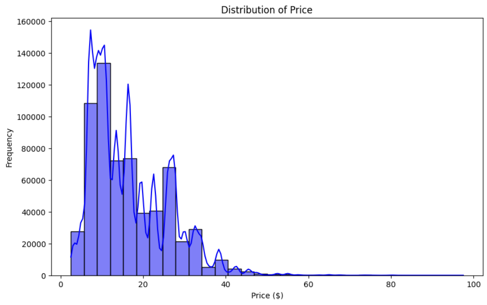
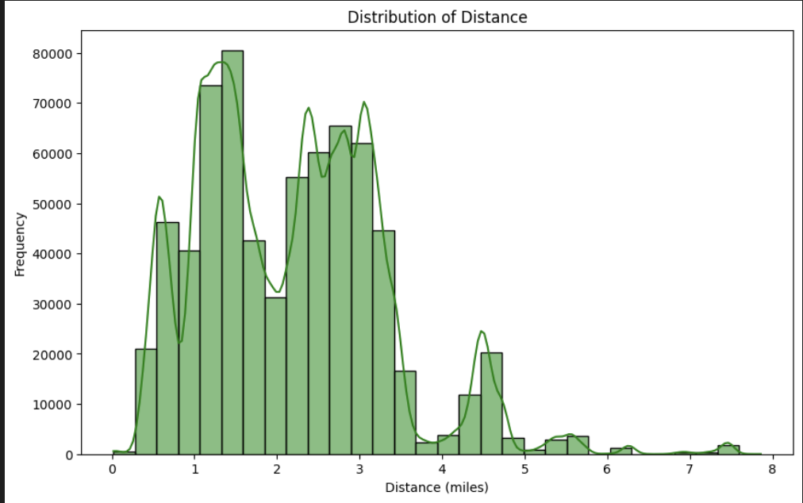
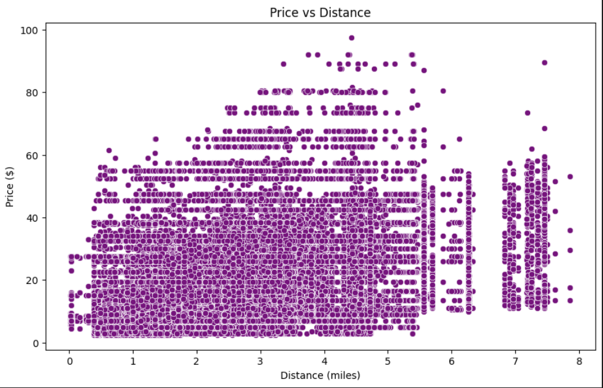
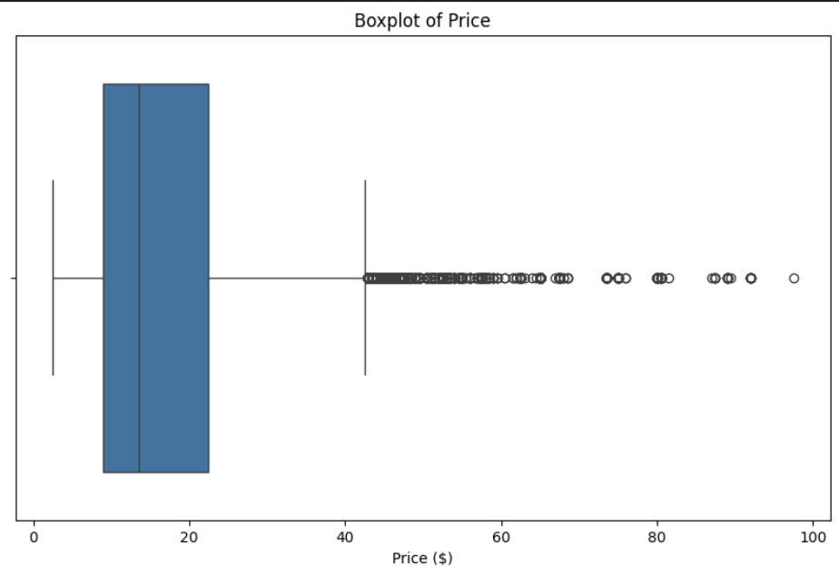
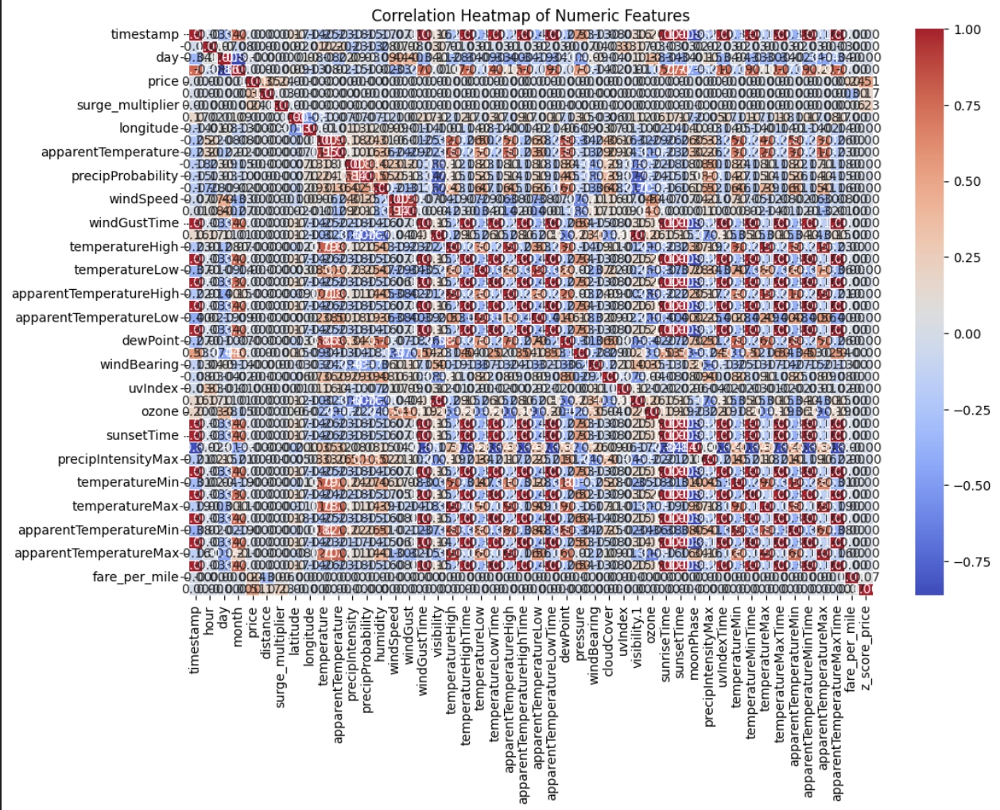
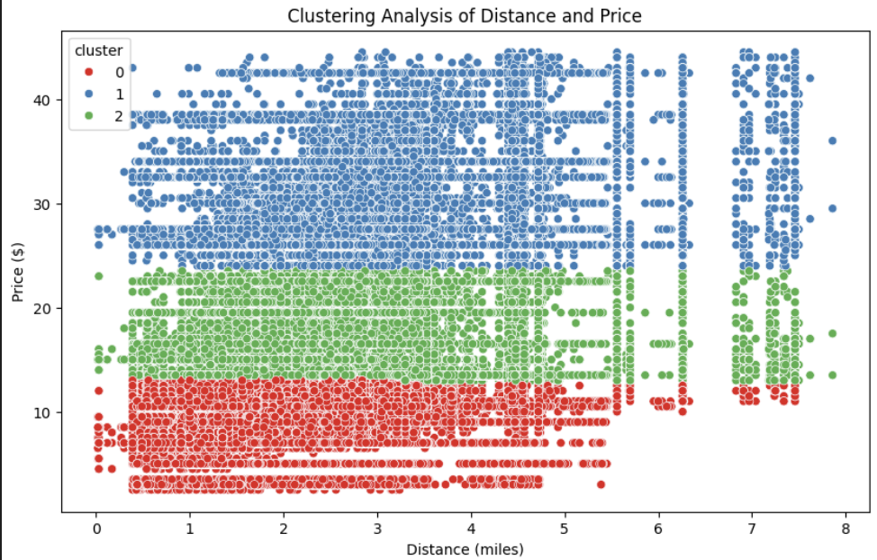

# Uber Rideshare Analysis

This project analyzes Uber rideshare data to understand factors affecting ride pricing, distances, demand patterns, and outlier behavior. It employs exploratory data analysis, statistical techniques, outlier detection, geospatial visualization, and clustering. Regression models, including Decision Trees and Random Forest regressions, are used to evaluate and predict ride prices.

# [Link to our Presentation](https://drive.google.com/drive/folders/1ZUBNzQ4Vfx3murWiad8VpoiD11RBFV0T?usp=drive_link)

---

## Table of Contents
- [Dataset Information](#dataset-information)
- [Installation](#installation)
- [Analysis Workflow](#analysis-workflow)
- [Modeling and Evaluation](#modeling-and-evaluation)
- [Findings](#findings)
- [Visualizations](#visualizations)
- [Future Improvements](#future-improvements)
- [Conclusion](#conclusion)
- [License](#license)

---

## Dataset Information
The dataset used for this analysis contains data on 693,071 Uber rides, with 57 columns detailing information such as:
- **Ride details**: price, distance, cab type, source, destination.
- **Geolocation**: latitude, longitude.
- **Time and Date**: timestamp, hour, day, month.
- **Weather**: temperature, humidity, wind speed, visibility.

## Installation
To replicate this analysis, clone the repository and ensure the following dependencies are installed:

```bash
pip install pandas numpy matplotlib seaborn scikit-learn statsmodels plotly folium
```

Place the dataset (`rideshare_kaggle.csv.zip`) in the root directory.

## Analysis Workflow

1. **Data Processing**
   - **Basic Info**: Loaded the dataset and inspected its shape, columns, and data types.
   - **Missing Values**: Found missing values in the `price` column, later imputed using median values by hour and distance.
   - **Data Preview**: Displayed initial rows to confirm data integrity.

2. **Univariate Analysis**
   - **Distribution of Price and Distance**: Histogram plots for `price` and `distance` revealed their frequency distributions.
   - **Outlier Detection for Price**: Detected outliers using Z-score, removing 5,114 rows with extreme price values.

3. **Bivariate Analysis**
   - **Price vs Distance**: Scatterplot visualized the relationship, showing a positive correlation.
   - **Day of Week vs Price**: Analyzed variations across different days (if applicable).
   - **Hourly Price Patterns**: Analyzed price across times of day (e.g., morning, afternoon).

4. **Multivariate Analysis**
   - **Correlation Analysis**: Computed correlations among numerical features, visualized in a heatmap to identify highly correlated attributes.
   - **Variance Inflation Factor (VIF)**: Tested for multicollinearity among features like distance and fare per mile.

5. **Outlier Detection**
   - **Local Outlier Factor (LOF) and Z-score**: Used these methods to identify and handle outliers in price and distance.

6. **Clustering Analysis**
   - **KMeans Clustering**: Clustered rides into 3 categories based on price and distance.

7. **Geospatial Analysis**
   - **Mapping Ride Locations**: Created an interactive map of ride locations using `folium` to identify popular areas.
   - **Price vs Distance by Cab Type**: Used `plotly` to show relationships between price, distance, and cab type.

---

## Modeling and Evaluation

### 1. Linear Regression Model
   - **Training RMSE**: 7.777
   - **Testing RMSE**: 7.773
   - **Training R²**: 0.257
   - **Testing R²**: 0.258

### 2. Decision Tree Regressor
   - **Training RMSE**: 0.0
   - **Testing RMSE**: 0.132
   - **Training R²**: 1.0
   - **Testing R²**: 0.999
   - **Evaluation**: High performance on training and testing sets suggests overfitting due to perfect training fit.

### 3. Random Forest Regressor with Hyperparameter Tuning
   - **Best Parameters**: Determined using RandomizedSearchCV.
   - **Training RMSE**: 0.029
   - **Testing RMSE**: 0.078
   - **Training R²**: 0.999
   - **Testing R²**: 0.999
   - **Cross-Validation RMSE**: Mean RMSE of 0.081 with a standard deviation of 0.015 across folds, indicating strong generalizability.

### Model Selection
   - **Best Model**: Random Forest Regressor, balancing performance and generalizability.
   
   ### Feature Importance
   - **Analysis**: Visualized feature importance from the Random Forest model, identifying distance and cab type as significant contributors.

---

## Findings

- **Pricing Trends**: Rides with greater distances typically cost more, showing a clear positive correlation between distance and price.
- **Outliers**: Significant price outliers were detected and removed; clustering reveals distinct groups in terms of price and distance.
- **Geolocation Insights**: Mapping rides indicates popular pickup/drop-off locations.
- **Time-Based Trends**: Pricing fluctuates based on time of day and day of the week.
- **Best Model**: The Random Forest Regressor outperformed other models' accuracy and generalizability, making it the most effective for this analysis.

## Visualizations

- **Price Distribution** - Shows the frequency of different prices.  
  

- **Distance Distribution** - Displays the frequency of different ride distances.  
  

- **Price vs Distance** - Scatterplot indicating the relationship.  
  

- **Boxplots** - Visualize price variation across time/day.  
  

- **Heatmap** - Correlation heatmap of numerical features.  
  

- **Clustering Analysis** - Visualization of clusters in price and distance.  
  

- **Map** - Interactive map marking each ride’s geolocation.  
  [Open Map](img/ride_map.html)

## Future Improvements

- **Feature Engineering**: Create additional features based on timestamps (e.g., rush hours, weekends).
- **Advanced Machine Learning**: Implement additional machine learning models to improve predictive power.
- **Enhanced Outlier Detection**: Try alternative outlier detection methods.
- **Customer Insights**: Segment rides based on cab type and user behavior.

## Conclusion

This analysis provides valuable insights into Uber rideshare data, highlighting price determinants and identifying patterns across geolocation and time. The findings, supported by a well-performing Random Forest model, could help predict demand and optimize prices.

## License

This project is licensed under the MIT License.
